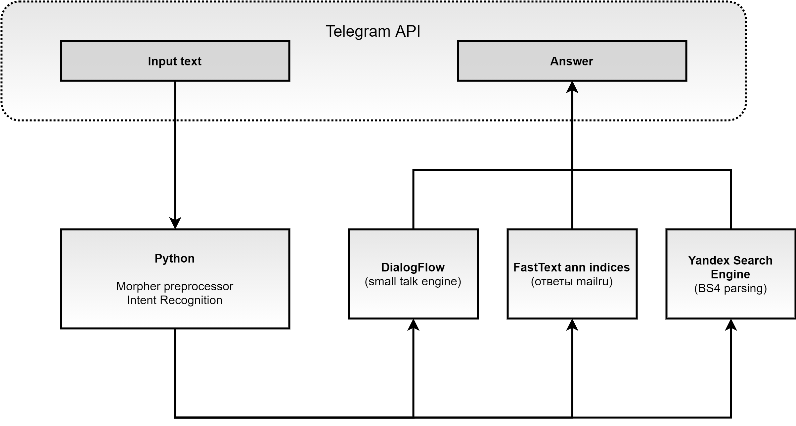

# GeekBrains NLP: Введение в обработку естественного языка

## Содержание:
- Telegram ChatBot
- Практические модули

---
### [Telegram ChatBot](https://github.com/Nickel-nc/GU_NLP/tree/master/TelegramChatBot)
#### [Sandbox Notebook](https://github.com/Nickel-nc/GU_NLP/blob/master/TelegramChatBot/Bot_R1D1_Sandbox.ipynb)
#### Data flow scheme


#### Локальный запуск

[Дампы модели](https://drive.google.com/drive/folders/1DzWEak9G5RrZVbc4ZE7678I2bM_cX5ZG?usp=sharing)

```
cd {REPO_FOLDER}

# Copy initial data 

$ mkdir -p ./TelegramChatBot-app/data
$ cp /path/to/unpacked/data/* ./data
$ python RunChatBot.py
```

---
### Практические модули

#### [1. Text Preprocessing](https://github.com/Nickel-nc/GU_NLP/blob/master/1.%20Preprocessing/1.%20Preprocessing.ipynb)
- Raw-text предобработка данных с твиттера (en)

#### [2. Creating Feature space](https://github.com/Nickel-nc/GU_NLP/tree/master/2.%20Feature%20space)
- Практика подготовки признакового пространства - **word2vec**, **fasttext**, **Annoy**, **поиск ближайших векторов ответов на вопрос**.

#### [3. NER samples](https://github.com/Nickel-nc/GU_NLP/blob/master/3.%20NER%20samples/NER_samples.ipynb)
- Практика определения именованных сущностей - **tweeter dataset (en)**, **nltk**, **spacy**.

#### [4. Classification](https://github.com/Nickel-nc/GU_NLP/blob/master/4.%20Classification/4.%20Classification.ipynb)
- Классификация позитивных / негативных интентов - **tweeter dataset (en)**, **nltk**, **wordnet**, **LR**, **TFIDF Vectorizer**, **CountVectorizer** , **BOW**.

#### [5. CNN classification](https://github.com/Nickel-nc/GU_NLP/blob/master/5.%20CNN%20classification/Conv_classification.ipynb)
- Практика улучшения качества классификации с помощью сверток - **dataset: отзывы mailru (ru)**, **keras Conv1d**, **pymorpy**, **nltk**, **word2vec**.

#### [6. RNN classification](https://github.com/Nickel-nc/GU_NLP/blob/master/6.%20RNN%20classification/6.%20RNN%20Classification.ipynb)
- Практика улучшения качества классификации с рекусивных нейросетей - **dataset: отзывы mailru (ru)**, **keras Conv1d**, **SimpleRNN**, **LSTM**, **GRU**, **pymorpy**, **nltk**, **word2vec**.

#### [7. Seq2Seq_Attention_Transformer](https://github.com/Nickel-nc/GU_NLP/tree/master/7.%20Seq2Seq_Attention_Transformer)
- Переводчик на основе генератора текстов - **[data source: manythings](http://www.manythings.org/anki/)**, **seq2seq**, **Attention Transformer**, **keras Conv1d**, **LSTM**.

#### [8. Bert](https://github.com/Nickel-nc/GU_NLP/blob/master/8.%20Bert/BERT_test_model.ipynb)
- Практика предсказания последовательностей с помощью BERT - **bert_token**, **keras_bert**.


